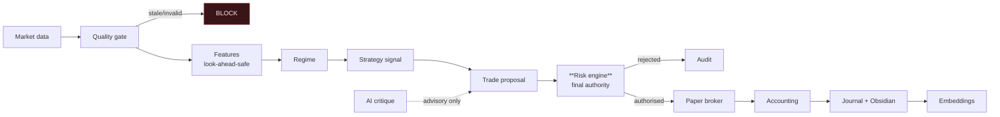

# Meridian

A forex research, backtesting and risk-control platform in which an LLM is one
supervised, non-authoritative component.

> **Status: architecture and planning. No application code exists yet.**
> This repository currently contains the design, the decision record and the milestone
> plan. Implementation begins at [Milestone 1](docs/milestone-1.md).

> `Meridian` is a placeholder name, confined to three files so it can be replaced
> globally in minutes.

---

## Safety limitations — read first

This system **cannot place a real trade**, and that is a design property rather than a
setting:

- No broker SDK is a dependency. No credential fields exist. No live adapter is written.
- `BrokerAdapter` has exactly one implementation: the paper broker.
- `MERIDIAN_MODE=broker` fails at startup.
- Defaults are research mode, paper trading, broker execution disabled,
  manual approval.

Adding live execution would be a deliberate, reviewable project — not a toggle.

Further:

- **No LLM can submit an order.** No code path exists from a model response to an
  order. The critique schema has no field capable of expressing a quantity.
- **The risk engine is the only path to an order**, enforced by a decision token bound
  to the proposal's content hash and by a non-nullable foreign key.
- **No strategy here is profitable, and none is claimed to be.** The two baseline
  strategies exist to exercise the infrastructure.
- **Nothing is fail-open.** Stale data, a crossed quote, an unreadable kill switch, a
  database error or an ambiguous account state all block new trades.

---

## What it is for

Research, historical backtesting, paper trading, and operating within configurable
prop-firm evaluation rules. The objective function is **the probability of satisfying a
selected evaluation profile while controlling drawdown**, not gross return.

---

## Architecture in one diagram



Full detail: [docs/architecture.md](docs/architecture.md).

---

## Documentation

| Document | Covers |
|---|---|
| [architecture.md](docs/architecture.md) | Determinism boundary, look-ahead prevention, risk finality, fill realism |
| [risk-engine.md](docs/risk-engine.md) | Invariants, forex arithmetic, rule catalogue, profiles, throttle |
| [data-model.md](docs/data-model.md) | Entities, decimal policy, immutability, lineage |
| [backtesting-methodology.md](docs/backtesting-methodology.md) | Validation protocol, bias controls, claim discipline |
| [prop-firm-profiles.md](docs/prop-firm-profiles.md) | Profile schema, verification, simulator |
| [model-routing.md](docs/model-routing.md) | Registry, permissions, fallback, no-LLM mode |
| [obsidian-memory.md](docs/obsidian-memory.md) | Vault boundary, sync, injection defence |
| [security.md](docs/security.md) | Threat model, secrets, redaction, audit |
| [development.md](docs/development.md) | Setup, commands, conventions |
| [milestone-1.md](docs/milestone-1.md) | Current scope and acceptance criteria |
| [decisions/](docs/decisions/) | ADRs, including every deviation from the brief |

---

## Environment

Verified 2026-07-27: Python 3.14.6 (full quant stack), Node 25.1.0, Ollama with
`llama3.2:3b` + `nomic-embed-text`, 8 GB RAM. No PostgreSQL, Redis or Docker — SQLite
and an in-process event bus are used locally, with Postgres as the production target.
Rationale in the ADRs.

---

## Setup

Not yet runnable. From Milestone 1:

```bash
cp .env.example .env
make setup && make seed && make dev
```

---

## A note on what this cannot do

It cannot tell you whether a strategy will make money. It can tell you whether a
strategy survived out-of-sample testing, how sensitive it was to its parameters, how
much of its profit came from one instrument or one month, what it cost in spread and
slippage, and how often it would have breached an evaluation rule.

Those are different questions, and only the second kind is answerable.
