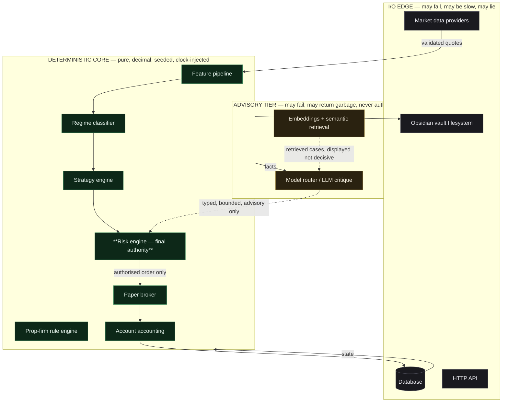
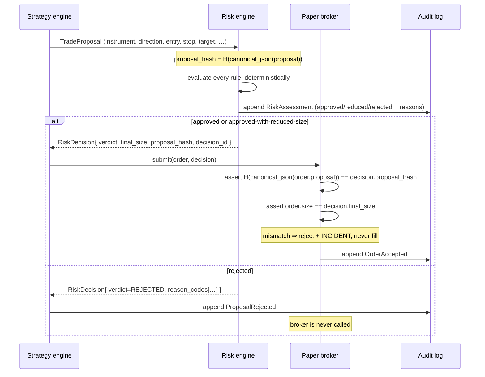
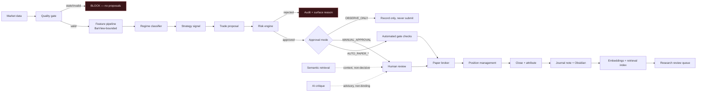

# Meridian — Architecture

> **Product name.** `Meridian` is a placeholder. It appears in exactly three places:
> `packages/config/product.py` (`PRODUCT_NAME`), `apps/web/config/product.ts`, and the
> `MERIDIAN_` environment prefix. Renaming is a three-file change plus one env-var
> rename. Do not scatter the name through the codebase.

---

## 1. What this system is, and what it is not

Meridian is a **forex research and risk-control platform** in which an LLM is one
supervised, non-authoritative component.

It **is**: a historical backtester, a paper-trading simulator, a deterministic risk
engine, a knowledge base, and a research environment.

It **is not**, and in this build **cannot become**, a live-money trading bot. There is
no broker credential path, no live order code, and no configuration value that enables
one. Live execution is not "disabled by a flag" — it is **not implemented**. See §9.

---

## 2. The organising principle: the determinism boundary

Every component belongs to exactly one of three tiers. The tier dictates what it is
permitted to do. This classification is the backbone of the whole design.



**Tier rules, enforced by review and by import-linting:**

| Tier | May do | May **not** do |
|---|---|---|
| Deterministic core | Pure computation on explicit inputs; `Decimal` arithmetic; seeded RNG | Call the network. Read the wall clock. Import the model router. Use `float` for money. Raise non-deterministically. |
| Advisory | Call LLMs and embedding providers; fail; time out | Produce an order. Produce a lot size. Mutate risk limits. Be on the critical path of an execution. |
| I/O edge | Network, disk, database | Compute risk. Compute size. Decide fills. |

The dotted arrow from `LLM` into `RISK` is the only advisory→core edge, and it carries
**typed, range-checked, non-executable data** — a verdict enum, a bounded confidence,
and free text destined for display. Never a quantity, never a command.

---

## 3. Why the core cannot read the clock

Every core function receives a `Clock`. There is no `datetime.now()` below the edge.

```python
class Clock(Protocol):
    def now(self) -> datetime: ...  # always tz-aware UTC


class SystemClock: ...  # production / paper


class ReplayClock: ...  # backtest; advances only as bars are consumed


class FrozenClock: ...  # tests
```

This buys three properties that are otherwise very hard to get:

1. **Replay determinism.** The same inputs and seed produce byte-identical results,
   because nothing varies with real time.
2. **Look-ahead impossibility at the time axis.** `ReplayClock` cannot return a
   timestamp beyond the bar being processed.
3. **Testable timezone and reset-boundary behaviour.** Daily-loss resets, session
   boundaries and prop-firm reset times are tested by advancing a `FrozenClock`
   across the boundary, not by waiting.

---

## 4. Why look-ahead bias is structurally prevented, not merely documented

Documenting "do not use future data" does not prevent it. Meridian makes the mistake
raise an exception.

The feature pipeline never receives a full price series. It receives a **`BarView`** —
a window pinned to the decision index `i`:

```
series:   [ b0 b1 b2 b3 b4 b5 b6 b7 b8 b9 ]
                         ↑ decision index i=4
BarView:  [ b0 b1 b2 b3 b4 ]  ─── readable
                            [ b5 … b9 ]  ─── IndexError on access
```

`BarView.__getitem__` raises `LookAheadError` for any index `> i`. Negative indexing is
relative to `i`, not to the end of the array — the classic silent-leak vector. A
strategy that tries to peek crashes the backtest with a stack trace naming the
offending feature.

The same view type is used in backtest, replay and paper trading, so a strategy cannot
behave differently between them.

**Corollary rule:** a feature computed at index `i` may use bar `i`'s *open* and any
fully-closed bar `≤ i-1`. Using bar `i`'s close to trade bar `i`'s close is the most
common leak in retail backtesting; the engine's fill model forbids it (§6).

---

## 5. Risk-engine finality is structural

"The risk engine cannot be overridden" is only true if there is no other code path to
an order. Meridian enforces this with an **authorisation token bound to proposal
content**:



The broker's `submit()` has **no code path that fills an order without a matching
decision token**. This defeats the realistic attack: approve a 0.2-lot trade, then
submit 2.0 lots. The hash covers instrument, direction, entry, stop, target and size,
so any mutation invalidates the token.

`RiskDecision` is not constructible outside the risk engine module (private
constructor + module-internal factory). A strategy cannot forge one.

---

## 6. Fill realism — the assumptions that decide whether a backtest means anything

The engine models the **bid/ask pair**, never a single mid price.

| Event | Fill rule |
|---|---|
| Buy market | fill at **ask** of the *next* bar, + slippage |
| Sell market | fill at **bid** of the *next* bar, + slippage |
| Buy stop / sell stop | triggered by the touching side; filled with gap-through at the worse of trigger and next available price |
| Limit | filled only if price trades **through** the level, not merely touches it |
| Stop-loss vs take-profit in the same bar | **stop-loss wins** — the pessimistic assumption, unless intrabar data proves otherwise |
| Weekend / holiday gap | position marked to the gapped open; stops fill at the gap, not the stop level |

Decisions are made on bar `i`; fills occur at bar `i+1`. The one-bar delay is not
configurable downward — removing it is the difference between a plausible backtest and
a fantasy.

**Stop-loss-wins** is deliberately conservative. When both levels fall inside one bar,
the engine cannot know the path, so it assumes the adverse outcome. Reported results
are therefore a lower bound on that specific ambiguity, and the ambiguous-bar count is
reported alongside every backtest so the reader knows how often it mattered.

---

## 7. Component map

```
apps/
  api/        FastAPI. HTTP edge, auth, redaction middleware, request IDs.
              Owns no business logic — it validates, delegates, serialises.
  web/        Next.js App Router. Presentation only.
  worker/     Scheduled + event-driven jobs: note generation, embeddings,
              batch AI review, daily rollups. Never on an order's critical path.

packages/
  config/     Settings (pydantic-settings), product constants, feature flags,
              the system-wide hard limits that clamp every profile.
  schemas/    Single source of truth for cross-boundary types. Pydantic models
              generate JSON Schema → TypeScript types. Frontend never hand-writes
              a domain type.
  model-router/     Registry, task→model routing, providers, structured-output
                    validation, cost accounting, redaction.
  obsidian-memory/  Vault I/O, templates, frontmatter, link generation, sync
                    with the permitted-field allowlist.
  ui/         Design system primitives.

services/           Pure-Python domain modules, imported in-process by api/worker.
  market-data/      Provider interface, synthetic generator, replay, importers,
                    quality scoring.
  strategy-engine/  Strategy protocol, registry, versioning, baselines.
  risk-engine/      THE authority. Rules, profiles, throttle, decisions.
  backtest-engine/  Event loop, fills, walk-forward, stress tests, metrics.
  paper-broker/     Order lifecycle, state machine, positions, accounting.
  journal-engine/   Trade notes, lessons, annotations.
  analytics-engine/ Metrics, attribution, Monte Carlo.
```

**`services/` are modules, not microservices.** In-process calls are synchronous,
deterministic and free of network non-determinism — exactly what a backtest needs to be
reproducible. Kubernetes, Kafka and service meshes are explicitly out of scope for v1.
The module boundary is enforced by import rules; if a service ever needs to become a
process, the boundary already exists.

---

## 8. The trade lifecycle end to end



Retrieval and AI critique attach to the **human review** step, not to the risk gate.
They inform a person. They do not gate an order. That placement is the whole point.

---

## 9. Why live trading is absent rather than disabled

A disabled feature is one config change from being an enabled feature. Meridian
instead omits the capability:

- No broker SDK is a dependency.
- No credential fields exist in settings.
- `BrokerAdapter` is defined as a **Protocol with one implementation: the paper
  broker.** There is no live implementation to point a flag at.
- `MERIDIAN_MODE=broker` raises a startup error naming this document.

Adding live trading later is a deliberate, reviewable project — new dependency, new
credential handling, new adapter, new tests, new audit surface. It is not a toggle, and
it should not be.

---

## 10. Fail-closed behaviour

Every one of these conditions **blocks new trade proposals**. None of them is a
warning-only state.

| Condition | Detected by |
|---|---|
| Market data older than `MAX_DATA_AGE_SECONDS` | Quality gate |
| Bid ≥ ask, or non-positive price | Quality gate |
| Spread beyond instrument's abnormal threshold | Quality gate |
| Missing bars in the expected sequence | Quality gate |
| Database unreachable | Repository health probe |
| Kill switch engaged, **or unreadable** | Config + state store |
| Drawdown above the configured hard block | Risk engine |
| Prop-firm rule violated or within buffer | Prop-firm engine |
| Ambiguous account state (reconciliation mismatch) | Accounting invariant check |
| Clock moved backwards | Clock guard |

"Unreadable" mapping to "engaged" is the important detail: a failure to determine the
kill-switch state is treated as engaged, not disengaged.

---

## 11. Documents

| Document | Covers |
|---|---|
| [data-model.md](data-model.md) | Entities, IDs, timestamps, decimal policy, lineage |
| [risk-engine.md](risk-engine.md) | Rules, profiles, throttle, decision format, invariants |
| [prop-firm-profiles.md](prop-firm-profiles.md) | Profile schema, verification discipline, simulator |
| [backtesting-methodology.md](backtesting-methodology.md) | Validation protocol, bias controls, what may be claimed |
| [model-routing.md](model-routing.md) | Registry, task permissions, fallback, no-LLM mode |
| [strategy-platform.md](strategy-platform.md) | Strategy plugins, allocator, discovery gates, research lab |
| [machine-learning.md](machine-learning.md) | Meta-labelling, purged CV, feature store, model lineage |
| [obsidian-memory.md](obsidian-memory.md) | Vault boundary, sync direction, allowlist, conflicts |
| [security.md](security.md) | Secrets, redaction, prompt injection, audit |
| [development.md](development.md) | Setup and commands |
| [decisions/](decisions/) | ADRs, including deviations from the original brief |
