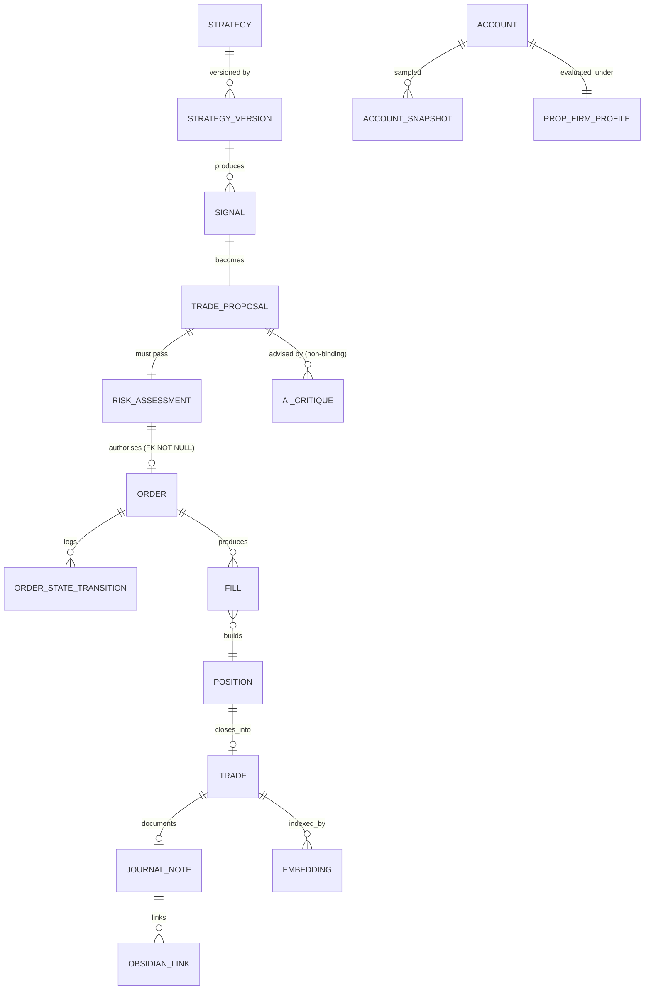

# Ñemonis — Data Model

PostgreSQL is the intended production source of truth. SQLite is the local-development
backend. The schema is written dialect-neutral so one Alembic chain serves both; see
[ADR-0002](decisions/0002-sqlite-first-postgres-ready.md).

---

## 1. Cross-cutting conventions

**Identifiers.** Every entity has `id`, a prefixed ULID: `tr_01JQ…` (trade), `ord_…`,
`sig_…`, `rd_…` (risk decision), `ae_…` (audit event). ULIDs sort lexicographically by
creation time, are collision-free without coordination, and the prefix makes a
mis-joined ID obvious in a log line. Never expose a bare integer PK across a boundary.

**Timestamps.** Every table carries `created_at`. Time-bearing entities additionally
distinguish:

| Column | Meaning |
|---|---|
| `event_time` | When the thing happened in market time |
| `source_time` | Timestamp the provider claims |
| `arrival_time` | When we received it |
| `decision_time` | The instant the system was allowed to act on it |

All stored UTC, tz-aware. `decision_time ≥ arrival_time ≥ source_time` is a checked
invariant — a violation means the data is wrong or the clock is, and both block trading.
Keeping these separate is what makes look-ahead auditable after the fact.

**Decimal storage.** Money, prices, sizes and percentages are `NUMERIC(28,10)` on
Postgres and `TEXT`-encoded decimal on SQLite, both mapped through a SQLAlchemy
`TypeDecorator` that returns `Decimal`. Floats are never used for these. A float
arriving at the boundary raises.

**Immutability.** `audit_events`, `fills`, `risk_assessments` and `model_invocations`
are append-only. No `UPDATE`, no `DELETE`. Enforced by database trigger on Postgres and
by repository-level guard on both backends. Corrections are new compensating rows that
reference the original.

**Soft state vs derived state.** Anything recomputable from primary records
(equity curves, metrics, regime labels) is marked derived and may be rebuilt. Anything
recording a decision or an event is primary and is never regenerated.

---

## 2. Entity groups

### Reference data

**`instruments`** — the contract specification. Never inferred from a symbol string.

```
id, symbol, broker_symbol, base_ccy, quote_ccy, digits, pip_size, point_size,
contract_size, min_lot, lot_step, max_lot, stop_level_points, freeze_level_points,
margin_rate, commission_per_lot, swap_long, swap_short, swap_3day_weekday,
trading_sessions[], enabled, spec_source, spec_verified_at
```

`spec_source` + `spec_verified_at` exist because broker contract specs drift and differ.
`GBPJPY` at one broker is not `GBPJPY.pro` at another, and pip size, lot step and stop
level all vary. Treating these as constants is a correctness bug.

**`currencies`**, **`market_sessions`**, **`holiday_calendar`**, **`economic_events`**.

### Market data

**`candles`** — `(instrument_id, timeframe, event_time)` unique. Stores bid and ask OHLC
separately, never a single mid. Postgres partitions by month; SQLite uses a plain index.
Bulk history lives in Parquet under `data/parquet/`, partitioned
`instrument/timeframe/year/month`, with the database holding the authoritative index of
what exists.

**`ticks`**, **`spread_observations`**, **`data_quality_reports`** —
`(provider, window, missing_intervals, duplicates, outliers, bid_ask_violations,
max_gap, quality_score, verdict)`. The verdict feeds the risk engine's stale/invalid
gates directly.

### Strategy and signal

**`strategies`** → **`strategy_versions`** → **`strategy_parameter_sets`**.

Lineage is the point. `strategy_versions` stores `code_hash`, `git_sha`, `created_at`,
`promotion_status` and the immutable parameter set. Every signal, backtest and trade
references a `strategy_version_id`, never a `strategy_id` alone. This guarantees any
historical result can name the exact code and parameters that produced it — without it,
performance attribution is guesswork.

`promotion_status`: `DRAFT → BACKTESTED → VALIDATED → OUT_OF_SAMPLE_TESTED →
PAPER_DEPLOYED → PROMOTED → RETIRED`. Transitions are recorded, not overwritten.

**`signals`** — direction, timestamps, setup type, entry/stop/target *concepts*,
confidence, `feature_snapshot` (JSON), `regime_id`, invalidation conditions,
`data_dependencies`. The feature snapshot is stored verbatim so a signal can be
re-derived and disputed later.

A signal expresses concepts, **not a lot size**. Sizing belongs to the risk engine
alone.

### Proposal → decision → execution

**`trade_proposals`** — a signal plus account context, hashed canonically.

**`risk_assessments`** — immutable. The full `RiskDecision` payload from
[risk-engine.md §5](risk-engine.md), including `proposal_hash`, verdict, reason codes,
before/after values, rules evaluated, and both profile versions.

**`orders`** — carries `risk_decision_id` (NOT NULL, FK). *An order cannot exist
without a risk decision.* This is invariant I1 expressed as a schema constraint rather
than a convention.

**`order_state_transitions`** — every transition, with `from_state`, `to_state`,
`actor`, `reason`, `at`. The state machine is validated in code; this table is the
evidence.

**`fills`**, **`positions`**, **`trades`** — a trade aggregates its fills and carries
realised outcome: `r_multiple`, `pnl_account_ccy`, `mfe`, `mae`, entry/exit spread,
slippage, commission, swap, holding period.

### Account

**`accounts`**, **`account_snapshots`** (balance, equity, floating P&L, margin, free
margin, drawdown state, high-water mark, taken at every material event), and
**`account_reconciliations`** — periodic assertion that
`balance + floating == equity` and that positions sum to recorded exposure. A mismatch
sets `ACCOUNT_STATE_AMBIGUOUS` and blocks trading.

### Rules

**`prop_firm_profiles`** and **`rule_evaluations`** — see
[prop-firm-profiles.md](prop-firm-profiles.md).

### Research

**`backtests`**, **`walk_forward_runs`**, **`experiments`** — each pinned to a
`strategy_version_id`, a data range, a seed, and a config hash so runs are reproducible.

### AI and memory

**`model_invocations`** — immutable. `task`, `model_id`, `provider`, prompt hash
(**not the prompt**), token counts, cost, latency, outcome, validation result,
`redaction_applied`. Cost accounting and the daily cap read from here.

**`ai_critiques`** — the validated structured verdict. Stored only after schema
validation passes; rejected outputs are recorded as invocation failures with the
rejection reason, never as critiques.

**`journal_notes`**, **`obsidian_links`**, **`embeddings`**
(`content_hash`, `embedding_version`, `chunk_version`, `model_id`, `dimensions`,
metadata for filtering), **`similarity_matches`**.

### Safety

**`audit_events`** — append-only, hash-chained: each row stores
`prev_hash` and `hash = H(prev_hash || canonical_payload)`. Tampering breaks the chain
and is detectable by a verification job. Covers every proposal, rejection,
modification, simulated execution, risk-setting change, profile change, kill-switch
action and mode change.

**`incidents`**, **`kill_switch_events`**.

---

## 3. Relationships that carry the safety guarantees



Two edges do the heavy lifting:

- `RISK_ASSESSMENT ||--o| ORDER` with a non-nullable FK — no risk decision, no order,
  enforced by the database rather than by discipline.
- `AI_CRITIQUE` attaches to the **proposal**, not the order. An AI opinion is
  associated with a decision under consideration and can never become part of an
  order's authorisation chain.

---

## 4. Dialect-neutrality rules

To keep one migration chain valid on both backends:

| Concern | Approach |
|---|---|
| JSON | `JSON` type; no Postgres-only operators in queries. Indexed JSON paths are extracted into real columns instead. |
| Enums | `VARCHAR` + `CHECK` constraint, not native `ENUM`. Adding a value is then a plain migration on both. |
| Timestamps | Store UTC as timezone-aware; never rely on server-local time. |
| Partitioning | Postgres-only, applied by a conditional migration branch keyed on dialect. SQLite gets an index. |
| Vector search | `pgvector` when available; otherwise a numpy brute-force index over stored embeddings. Behind `VectorStore`, so call sites are identical. At research scale (10⁴–10⁵ vectors) brute force is entirely adequate. |
| Append-only | Postgres trigger; SQLite repository guard. Both tested. |
| Upserts | SQLAlchemy `on_conflict_do_update` / `ON CONFLICT` — supported by both. |

Test suites run against SQLite by default and against Postgres when
`NEMONIS_TEST_POSTGRES_URL` is set, so dialect drift surfaces in CI rather than in
production.
