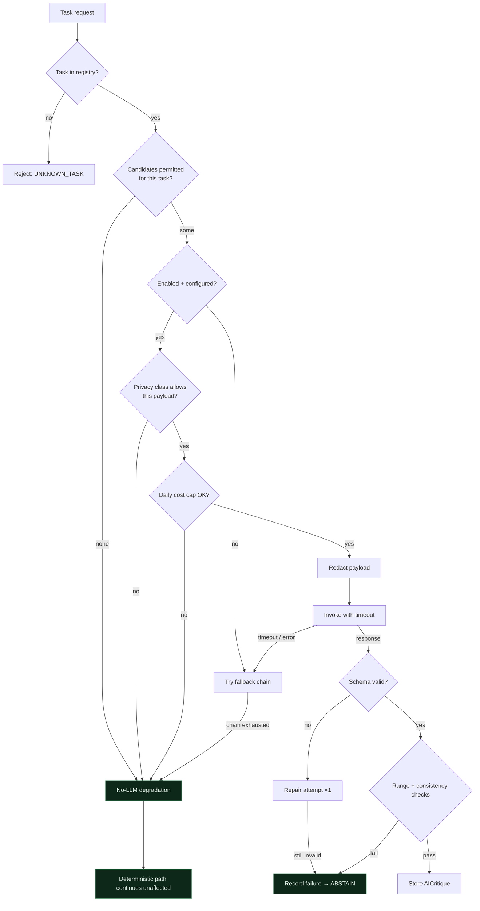

# Meridian — Model Routing

An LLM is never the trading algorithm. It analyses, retrieves, classifies, critiques
and drafts. Numerical calculation, risk control and execution are deterministic code.

---

## 1. Capability boundary

| Permitted | Forbidden |
|---|---|
| Tag and summarise notes | Submit an order |
| Classify context, extract entities | Produce a lot size or quantity |
| Retrieve and rank similar cases | Modify a risk limit |
| Critique a proposal (advisory) | Override a rejection |
| Propose research hypotheses | Compute a price, P&L or drawdown |
| Draft reviews and explanations | Be called per tick |

Structurally enforced: the model router **cannot import** the paper broker or the risk
engine's mutation surface, and `AICritique` has no numeric field that any execution path
reads. The strongest guarantee is not a rule — it is that no code path exists from a
model response to an order.

**No LLM is called per tick.** Invocation is event-driven (proposal created, trade
closed) or scheduled (daily rollup, weekly review). Per-tick inference would be
non-deterministic, slow, expensive, and would place a fallible component on the
critical path.

---

## 2. Registry

Models are declared in `packages/config/models.yaml`. No model identifier is
hard-coded anywhere else.

```yaml
- key: local-worker
  provider: ollama
  model_id: llama3.2:3b
  location: local
  privacy: unrestricted          # never leaves the machine
  cost_class: free
  structured_output: json_mode   # Ollama `format: json`
  max_context: 131072
  timeout_s: 120
  retries: 2
  enabled: true
  fallback: null
  permitted_tasks: [tag_note, summarise_trade, extract_entities, generate_links,
                    draft_daily_summary, classify_context]

- key: local-embed
  provider: ollama
  model_id: nomic-embed-text
  location: local
  privacy: unrestricted
  dimensions: 768
  permitted_tasks: [embed]
  enabled: true

- key: local-worker-large
  provider: ollama
  model_id: qwen3:8b
  enabled: false                 # 5.8 GB on an 8 GB machine — see ADR-0003
  # …

- key: cloud-reasoning
  provider: openai
  model_id: gpt-5.6-terra
  location: cloud
  privacy: redacted_only
  cost_class: standard
  structured_output: json_schema
  timeout_s: 90
  retries: 1
  enabled: false                 # requires OPENAI_API_KEY
  fallback: local-worker
  permitted_tasks: [critique_proposal, analyse_trade_batch, compare_regimes,
                    analyse_degradation, propose_hypotheses, review_weekly]

- key: cloud-escalation
  provider: openai
  model_id: gpt-5.6-sol
  cost_class: high               # requires explicit user confirmation per call
  enabled: false
  fallback: cloud-reasoning
  permitted_tasks: [propose_hypotheses, analyse_degradation, deep_research]

- key: senior-research
  provider: anthropic
  model_id: claude-opus-4-8
  cost_class: high
  enabled: false
  fallback: cloud-reasoning
  permitted_tasks: [code_analysis, architecture_review, deep_research]
```

Every field is load-bearing. `permitted_tasks` is an **allowlist**: a task not listed
cannot be routed to that model, so a cheap local model can never be handed a task it
will do badly, and an expensive one is never invoked casually. `privacy` gates what may
be sent (§4). `cost_class: high` requires per-call confirmation.

---

## 3. Routing



Every terminal state is safe. Failure, timeout, invalid schema, exhausted budget and
missing provider all converge on **the deterministic system continuing without AI
input**. Nothing blocks on a model.

---

## 4. What is redacted before any prompt leaves the process

Applied by `packages/model-router/redaction.py` to every outbound payload, cloud and
local alike:

| Removed / replaced | Reason |
|---|---|
| API keys, tokens, credentials | Never needed for analysis |
| Broker account numbers | Replaced with `acct_<hash8>` |
| Absolute balances and equity | Converted to percentages and R multiples |
| User name, email, file paths | Not analytically relevant |
| Anything matching secret patterns | Defence in depth |

A model reasons perfectly well about "risked 0.35%, result −1.0R, drawdown 4.2% of
allowance". It has no need for "£47,318.22 in account 5583991". Percentages are also
more comparable across accounts, so redaction improves analysis quality rather than
degrading it.

For `privacy: unrestricted` (local) models the redaction still runs — cheap, and it
keeps one code path.

---

## 5. Structured output and validation

Every AI task declares a Pydantic response model. Ollama gets `format: json`; cloud
providers get JSON-schema-constrained output. Neither is trusted:

1. Parse. Failure → one repair attempt with the validation error appended.
2. Validate against the schema. Unknown fields rejected, not ignored.
3. Range checks: confidence in `[0,1]`, enums in range, arrays within length bounds.
4. Consistency checks: e.g. `decision=SUPPORT` with confidence < 0.5 is contradictory
   and downgraded to `ABSTAIN`.
5. Citation check: claims about historical cases must reference IDs that were actually
   in the retrieved context. Uncited claims are stripped, and the critique is flagged.
6. **Injection scan** on any text originating from journal notes or retrieved content
   (see [security.md](security.md)).

Failing any step yields `ABSTAIN` with the reason recorded. An unparseable model is
indistinguishable, to the rest of the system, from an absent one — which is exactly
right.

### AI critique schema

```python
class AICritique(BaseModel):
    decision: Literal["SUPPORT", "OPPOSE", "ABSTAIN", "NEED_MORE_DATA"]
    confidence: Decimal  # [0,1]
    reasons: list[str]  # ≤ 5, each ≤ 300 chars
    contradictory_evidence: list[str]
    similar_cases: list[SimilarCaseRef]  # must cite retrieved IDs
    regime_comparison: str | None
    data_quality_concerns: list[str]
    risk_concerns: list[str]
    missing_information: list[str]
    suggested_questions: list[str]
    non_binding_recommendation: str
    model_config = ConfigDict(extra="forbid")
```

There is deliberately **no size, price, quantity or order field**. The schema cannot
express an executable instruction, so a compromised or confused model cannot emit one.

---

## 6. How critique is consumed

Configurable per profile, `packages/config/ai_policy.yaml`:

| Mode | Effect |
|---|---|
| `INFORMATIONAL` | Displayed to the user. No effect on flow. **Default.** |
| `VETO` | `OPPOSE` above a confidence threshold blocks the proposal. Can only ever *reject*, never approve. |
| `ENSEMBLE` | One weighted vote among deterministic signals. |
| `REQUIRED_ABOVE_RISK` | Above a risk threshold, a critique must be present and non-opposing. |

Default is `INFORMATIONAL` during early development: the critique's quality is unproven,
and unproven components do not get authority. Note that even `VETO` is one-directional —
AI can stop a trade, never start one. That asymmetry is deliberate and permanent.

---

## 7. No-LLM mode

`MERIDIAN_OLLAMA_ENABLED=false` with no cloud keys is a fully supported configuration.
Backtesting, replay, the risk engine, the paper broker, accounting, metrics, the vault
and every dashboard work unchanged. Lost: AI critiques, auto-tagging, semantic
retrieval (exact and metadata filtering still work), drafted summaries.

This is a tested configuration in CI, not merely an aspiration — it is the proof that
the LLM is genuinely not the algorithm.
