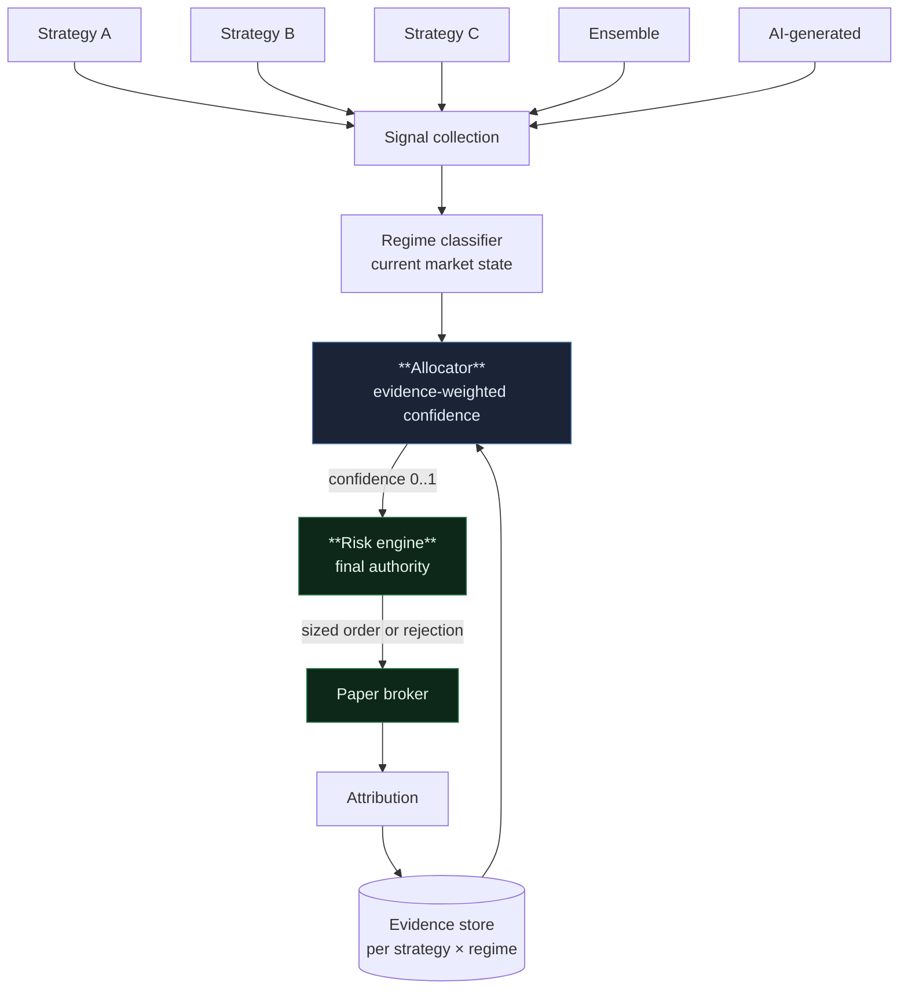
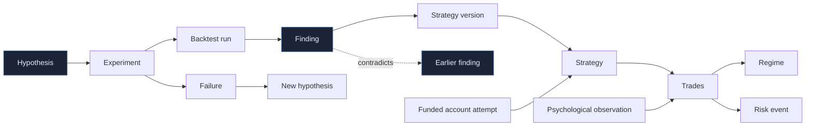

# Meridian — Multi-Strategy Platform

Meridian hosts many competing strategies rather than running one. Strategies are
independent plugins that can be enabled, disabled, compared and retired without
touching each other or the core.

The system's job is not to run a strategy. It is to **hold a portfolio of
hypotheses, allocate attention among them on evidence, and retire the ones that
stop working** — while never becoming attached to any of them.

---

## 1. The central danger, stated first

Everything in this document is downstream of one problem, so it goes first.

**A system that continuously compares many strategies across many conditions is a
machine for discovering patterns that do not exist.**

The arithmetic is unforgiving. With 100 strategies × 4 trend/volatility regimes ×
4 sessions there are 1,600 cells. Testing each at the conventional 5% threshold
yields **about 80 "significant" findings from pure noise**. Every one will look
exactly like "Strategy C works around London Open" — a specific, plausible,
actionable, and entirely imaginary edge.

The naive implementation — compute per-regime expectancy, allocate to the winners
— does not merely fail to avoid this. It systematically converts noise into
capital allocation, then reports rising confidence as the allocation concentrates.

So the platform is built around four controls, and they are not optional:

| Control | Prevents |
|---|---|
| **Shrinkage** (§5.2) | Small-sample cells producing extreme estimates |
| **FDR correction** (§5.3) | The 80-false-discoveries problem |
| **Minimum-evidence gates** (§5.4) | Allocation moving on noise |
| **Out-of-sample confirmation** (§5.5) | Discoveries that only exist in the discovery data |

A discovery that has not passed all four is a **hypothesis**, not a finding, and
is recorded as such. The distinction is enforced in the type system: `Hypothesis`
and `Finding` are different objects, and only a `Finding` can change an
allocation.

---

## 2. Capacity: why "hundreds of strategies" needs a funnel

Hundreds of strategies can *exist*. Only a handful should be *live*.

Evidence, not compute, is the binding constraint. A strategy needs roughly 100+
trades before its expectancy means much, and far more before regime-conditional
claims do. Running 100 strategies concurrently on 10 instruments does not give you
100 evaluated strategies — it gives you 100 under-evaluated ones, and a much
larger multiple-testing surface.

The architecture is therefore a **funnel**, not a flat pool:

```
   REGISTRY          hundreds — every strategy ever written, versioned
       │
       ▼  backtest + validation gates
   CANDIDATE         dozens — passed in-sample, awaiting out-of-sample
       │
       ▼  out-of-sample confirmation
   PAPER             ~10 — running on live data, no capital
       │
       ▼  paper evidence + allocator confidence
   ACTIVE            a few — receiving allocation
       │
       ▼  degradation or rule breach
   RETIRED           kept forever, with the reason
```

Retired strategies are never deleted. A strategy that failed in 2026 may be
exactly right in 2029, and the record of *why* it failed is itself research data.

---

## 3. A strategy is a plugin

```python
class StrategyPlugin(Protocol):
    manifest: StrategyManifest

    def generate(self, ctx: StrategyContext) -> Signal | NoAction: ...
```

The manifest is the contract, and it is declarative so the platform can reason
about a strategy without running it:

```python
@dataclass(frozen=True)
class StrategyManifest:
    id: str  # stable, e.g. "ma-trend"
    version: str  # semver; every change is a new version
    author: Literal["HUMAN", "AI", "ENSEMBLE"]
    hypothesis: str  # what it believes and why — required, not optional
    required_features: tuple[str, ...]  # validated against the registry
    lookback_bars: int  # derived from features; warm-up and purge length
    supported_instruments: tuple[str, ...] | None  # None = any
    supported_sessions: tuple[Session, ...] | None
    expected_regimes: tuple[str, ...] | None  # a PRIOR, never a filter — see §6
    max_signals_per_day: int
    deterministic: bool = True
```

`hypothesis` is mandatory. A strategy that cannot state what it believes cannot be
evaluated against whether that belief held, and "it backtested well" is not a
hypothesis.

### 3.1 What a strategy may and may not do

| May | May not |
|---|---|
| Read its `BarView` and features | See account state, balance or equity |
| Emit a signal with entry/stop/target *concepts* | Emit a lot size |
| Report its own confidence | See other strategies' signals or state |
| Declare invalidation conditions | Perform I/O, read the clock, use unseeded RNG |

A strategy is a **pure function of market state**. It cannot know how much money
there is, which is what stops position sizing leaking into strategy logic, and
what makes a strategy's behaviour identical in backtest, replay and paper.

### 3.2 Isolation

With dozens of plugins, one misbehaving strategy must not affect anything else:

- **Faults are contained.** An exception is caught, recorded against that
  strategy, and the loop continues. Repeated faults auto-disable it.
- **Time is budgeted.** A strategy exceeding its budget is skipped for that bar
  and charged a fault. One slow plugin cannot stall the portfolio.
- **State is private.** Plugins receive a context object, not the engine.
- **Determinism is verified.** Plugins declaring `deterministic=True` are
  spot-checked by re-running a bar and comparing output.

Faults are first-class data. A strategy that throws on high-volatility bars is
telling you something about its assumptions.

---

## 4. The allocator

The new central component. It sits **between the strategies and the risk engine**,
and it is the only place that decides how much attention a strategy gets.



**The allocator outputs a confidence, never a size.** It feeds the existing
`Signal.confidence` field and the risk engine's existing `BELOW_MIN_CONFIDENCE`
gate. The risk engine remains the sole authority on size, and can reject anything
the allocator loves. That boundary does not move.

### 4.1 Thompson sampling, not "pick the winner"

Allocation uses **Thompson sampling over per-strategy posteriors**, for a reason
that directly serves the requirement never to become attached to one strategy.

Greedy allocation ("weight by recent performance") has two failure modes: it
concentrates on whichever strategy got lucky recently, and it starves strategies
before they have enough evidence to judge — so a genuinely good strategy that
opens with three losses may never recover its allocation.

Thompson sampling draws from each strategy's posterior distribution over
expectancy and allocates to the draw. Consequences that matter here:

- A strategy with **wide uncertainty** still gets sampled sometimes. Exploration
  is automatic rather than a bolted-on epsilon.
- A strategy with **narrow, positive** posterior gets most of the allocation.
- A strategy with **narrow, negative** posterior fades out without being banned.
- Allocation **naturally decays** as evidence accumulates against a strategy, with
  no threshold to tune.

The exploration budget is capped: no more than a configured fraction of risk goes
to strategies below the evidence threshold, so exploration cannot become the
portfolio.

### 4.2 What the allocator may not do

- It may not exceed the portfolio risk budget — the risk engine enforces that.
- It may not resurrect a `RETIRED` strategy. Retirement is a human decision.
- It may not allocate to a strategy that has not passed out-of-sample testing.
- It may not act on a `Hypothesis`. Only a `Finding` moves an allocation.

---

## 5. How the system discovers "Strategy A works in trending markets"

This is the requirement that carries all the statistical risk, so the mechanism is
specified in full.

### 5.1 The evidence store

Every closed trade is attributed to a cell:

```
(strategy_version, regime_label, session, instrument_class)
```

Recorded with the trade's R multiple, the feature snapshot, the regime
classification *including its confidence*, and the provenance label. Trades taken
under a low-confidence regime classification are down-weighted — a label the
classifier was unsure of should not carry full evidential weight.

### 5.2 Shrinkage: the estimate is pulled toward the prior

A raw cell mean is nearly worthless at small N. Each cell estimate is shrunk:

```
θ̂_cell = w · mean_cell + (1 − w) · θ̂_strategy_overall
      where w = n_cell / (n_cell + k)
```

and the strategy's own mean is itself shrunk toward the global mean of all
strategies. `k` is the shrinkage constant, set from the between-cell variance
(empirical Bayes) rather than picked.

The effect: a cell with 8 trades and a spectacular mean barely moves off the
prior. A cell with 400 trades is trusted. This is the single most effective
control against the 80-false-discoveries problem, because it attacks it at the
estimate rather than at the decision.

### 5.3 Multiple-testing correction

All cells tested in a comparison run are corrected together using
**Benjamini–Hochberg FDR** at a configured rate (default 10%). The number of cells
tested — including cells that produced nothing — is recorded on every finding.

Reporting an uncorrected p-value from a grid search is not permitted, and the
`Finding` type has no field for one.

### 5.4 Minimum-evidence gates

A cell cannot produce a `Finding` unless all hold:

| Gate | Default |
|---|---|
| Trades in cell | ≥ 30 |
| Distinct instruments | ≥ 2 (else it is an instrument effect, not a regime effect) |
| Distinct months | ≥ 3 (else it is a period effect) |
| Regime-classification confidence | mean ≥ 0.6 |
| Effect survives FDR | yes |

The instrument and period gates matter as much as the count. "Works in trending
markets" that comes entirely from GBPJPY in one quarter is a statement about
GBPJPY in that quarter.

### 5.5 Out-of-sample confirmation

A `Finding` that passes §5.2–5.4 on the discovery window becomes a **candidate
finding**. It is promoted only after holding on data not used to discover it —
either a held-out window or forward paper trading.

Until then it appears in the UI and in Obsidian as a hypothesis, clearly marked,
and the allocator ignores it.

### 5.6 "Disable after N losses" is a hypothesis too

The requirement to learn that "Strategy D should be disabled after N losses" is
treated the same way. Loss-streak dependence is a testable claim — does
conditional expectancy after k consecutive losses actually differ from
unconditional? — and it is subject to the same gates.

Streaks occur constantly by chance. A strategy with a 45% win rate produces four
consecutive losses roughly every 15 trades. Concluding "it stops working after
four losses" from that is the classic gambler's-fallacy error, and the platform is
built so that a machine cannot make it on your behalf.

The deterministic loss-streak cooldown in the risk engine remains — as a *risk
control*, applied to everything, not as a discovered fact about a strategy.

---

## 6. Priors are not filters

`expected_regimes` on a manifest is a **prior**, recorded so the system can later
report whether the author was right. It does not filter signals.

If a trend strategy's manifest says it expects trending regimes, and the evidence
shows it actually performs best in ranging conditions, that is a finding worth
having — and it is unreachable if the manifest silently suppressed the signals
that would have revealed it.

Hard-filtering on a belief makes the belief unfalsifiable. Sessions and
instruments *are* hard filters, because those are capability constraints rather
than performance beliefs.

---

## 7. Portfolio risk becomes the binding constraint

The most important consequence for Stage C.

With one strategy, per-trade risk dominates. With fifty, the binding constraint
moves to the **portfolio**: fifty strategies can each pass their individual checks
and jointly be long EUR across every pair on the book.

The risk engine must therefore treat concurrent proposals as a set, not a
sequence:

- **Joint evaluation.** Proposals arriving on the same bar are evaluated together
  against the shared budget, not first-come-first-served.
- **Correlation-aware.** Currency exposure counts both legs across all strategies
  ([risk-engine.md §4](risk-engine.md), Tier C).
- **Per-strategy sub-budgets.** No single strategy may consume the whole budget.
- **Deterministic tie-breaking.** When proposals compete for the last of the
  budget, the resolution order must be reproducible — ranked by allocator
  confidence, ties broken by proposal hash. Never by arrival order, which is not
  reproducible in replay.

That last point is a genuine change to the Stage C design: the risk engine's entry
point takes a *set* of proposals, not one.

---

## 8. AI-generated strategies

The manifest's `author` field admits `AI`. An AI-authored strategy is subject to
**exactly the same gates** as a human-authored one — same funnel, same evidence
bar, same out-of-sample requirement. It gets no benefit of the doubt and no extra
suspicion.

What differs is provenance: the generating prompt, model, and parent strategy are
recorded, so a lineage of AI-generated strategies can be traced and its aggregate
hit rate measured. If AI-generated strategies underperform human ones, that is
measurable, and should be measured.

The LLM's role is proposing candidates and reading results. It does not evaluate
them — the deterministic pipeline does.

---

## 9. Obsidian as the research laboratory

The vault becomes the long-term knowledge graph. Note types and their links:



The cycle that matters is `Failure → New hypothesis`. A research platform that
only records successes is a scrapbook. Failures are where the information density
is, and they are linked forward so a future question ("why did we abandon
mean-reversion on JPY crosses?") has an answer.

**Every claim note carries its evidence level.** A finding note's frontmatter
records sample size, cells tested, FDR rate, whether it is confirmed out-of-sample,
and its status — so a two-year-old note cannot be mistaken for established fact
when it was a hypothesis all along.

**Psychological observations** are human-authored and human-owned. The system does
not infer your mental state. It records what you write, links it to the trades it
concerns, and can later show correlations — "risk increases followed losing days
in 7 of 9 cases" — which is a fact about behaviour, not a diagnosis.

Full mechanics in [obsidian-memory.md](obsidian-memory.md); the vault boundary is
unchanged, and Markdown still cannot alter account or audit records.

---

## 10. What this does not promise

It will not find a strategy that works. It hosts strategies and tells you, with
appropriate uncertainty, which ones have evidence behind them.

Most strategies in the registry will fail. That is the expected outcome and the
system is designed to make failure cheap, fast and informative rather than to
avoid it.

The discovery mechanism is deliberately conservative. It will miss real effects
that a looser system would "find" — and it will also decline to allocate capital
to the roughly 80 imaginary effects that a looser system would find in the same
grid. That trade is the entire point.
